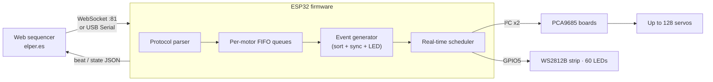

# PianoRoll — ESP32 Firmware

Real-time firmware that turns an ESP32 into the brain of a **servo-driven player piano**. It receives a musical sequence from a web app — over **WiFi (WebSocket)** or **USB (Serial)** — schedules every keystrike to the millisecond, drives up to 128 servos through PCA9685 boards, and mirrors each note on a WS2812B LED strip.

This is the embedded half of the [PianoRoll](https://elper.es) project. The web sequencer that talks to this firmware lives at **[elper.es](https://elper.es)**.

-00599C)

  

---

## What makes it interesting

This is not a "set a servo angle over HTTP" sketch. The design solves a few genuinely hard embedded problems:

- **Real-time event scheduler.** All per-motor movement queues are merged into a single timeline of timestamped events, sorted with `std::sort` (O(n log n)), and fired from the main loop by comparing each event's timestamp against `millis()`. Dozens of servos and LEDs move in parallel, each with its own rhythm. LED **look-ahead** events pre-light each key a configurable `advanceMs` *before* the strike (Synthesia-style).
- **Drift self-correction.** Per-bar sync markers measure the gap between the expected and the actual elapsed time (accumulated I²C latency) and *re-time the remaining future events on the fly* when the drift crosses a threshold — so the piece never slowly falls out of sync.
- **Hot-swap while playing (`APPEND`).** New movements can be pushed into the live queues and the event array regenerated **without resetting the playback clock** — you can change what a section plays mid-performance.
- **Transport-agnostic custom protocol.** A single command language (framing + stateful parser) runs identically over a WebSocket text frame and over the USB serial byte stream. The app doesn't care how the robot is connected.
- **Dynamic multi-bus hardware.** PCA9685 boards are auto-detected by an I²C scan across two independent buses at boot; motors are routed `chip = motor / 16`, `channel = motor % 16`. The architecture addresses up to 128 servos.
- **Interrupt-safe playback.** WebSocket callbacks never run the blocking playback loop — they only raise a flag (`g_pendingPlay`) and return; the main loop picks it up and does the timing-critical work. Network events can't stall, re-enter, or corrupt a sequence in progress.
- **Non-blocking startup.** WiFi connects in the background with a 15 s timeout and an immediate open-AP fallback — no blocking captive portal — so the HTTP and WebSocket servers are live at once, with or without a known network.
- **Safety by design.** A per-motor "note-on" watchdog returns any servo held in the strike position for too long back to home (so a stuck note can't burn a servo), plus heap-allocation guards, buffer-overflow guards and bounds checks throughout, and bit-packed event structs (bit 7 of `ledIdxOn` encodes on/off) to stay within DRAM.

> **Note on "velocity".** The servos are *positional* (e.g. ES08MA). The protocol's `v` value maps MIDI velocity to the **depth/force of the keystrike** (how far the arm travels from home), not to a commanded angular speed. Louder note → deeper press.

---

## Architecture

**Flow:** the app sends a sequence → the parser loads it into one FIFO queue per motor → the event generator flattens all queues into a single timestamp-sorted array (adding return-to-home, per-bar sync markers, LED events and Synthesia look-ahead) → the scheduler fires each event at its time, driving servos over I²C and LEDs over FastLED, while streaming beat/state messages back to the app.

  
   <em>The web sequencer (<a href="https://elper.es">elper.es</a>) that composes and streams sequences to this firmware.</em>

---

## Hardware

| Part | Role | Notes |
|------|------|-------|
| **ESP32** (or ESP32-S3) | Main controller | S3 also enables class-compliant USB-MIDI in a companion firmware |
| **PCA9685** (×1–8) | 16-channel PWM servo drivers | Auto-detected at `0x40` on each I²C bus |
| **Servos** (e.g. ES08MA) | One per key / finger | Positional, `50–90 Hz` PWM |
| **WS2812B strip** | Per-note lighting (Synthesia-style) | 60 LEDs, chromatic C1–B5 |

### Default pin map

| Signal | GPIO |
|--------|------|
| I²C bus 0 — SDA / SCL | 21 / 22 |
| I²C bus 1 — SDA / SCL | 16 / 17 |
| WS2812B data | 5 |

Servo PWM range: `SERVO_MIN 150` (0°) · `SERVO_NEUTRAL 375` (90°) · `SERVO_MAX 600` (180°), at `60 Hz`.
The boot routine probes `0x40` on both buses (up to 32 servos out of the box); the code supports up to 8 boards / 128 servos.

  
  
  

<em>ES08MA servos · wiring · WS2812B strip — all designed, assembled and tuned by hand.</em>

---

## Dependencies

Install through the Arduino IDE Library Manager:

- **Adafruit PWM Servo Driver Library** (`Adafruit_PWMServoDriver`)
- **FastLED**
- **WebSockets** by Markus Sattler (`arduinoWebSockets`)
- **CircularBuffer** by AgileWare

Built-in with the ESP32 core: `WiFi`, `WebServer`, `Wire`, `FS`, `SPIFFS`.

---

## Build & flash

1. Install the **ESP32 board package** (Espressif) in the Arduino IDE.
2. Install the libraries listed above.
3. Open `Esp32.2.ino`.
4. Select your ESP32 board and port.
5. Upload the web assets (`index.html`, `script.js`) to **SPIFFS** so the on-device server can serve them.
6. Compile and flash.

On boot the firmware runs an LED self-test (a cyan sweep of the strip), scans the I²C buses for PCA9685 boards, and starts the HTTP (`:80`) and WebSocket (`:81`) servers.

---

## Network setup

The firmware never hardcodes WiFi credentials — they are stored in NVS.

- **First boot / no saved network:** it comes up as an open access point **`midiGrid-Setup`** at **`192.168.4.1`**. Connect to it and open the app.
- **Join your WiFi:** from the app (or a browser) call `GET /setwifi?ssid=YourSSID&pass=YourPass`, or send `W YourSSID|YourPass` over serial. The ESP32 saves the network to NVS and reboots to join it.
- **Reset:** `GET /resetwifi` (or serial `R`) clears the saved network and reboots back into AP mode.

Connection to the sequencer is then either **WebSocket** (`ws://<device-ip>:81`) or a direct **USB serial** cable (`115200` baud) — the protocol is identical on both.

---

## Communication protocol

Commands are `;`-terminated. They can be sent one at a time (debug) or bundled inside a `PLAY` / `APPEND` block.

### Framed messages (WebSocket / Serial)

| Message | Meaning |
|---------|---------|
| `PLAY\|name\|stepMs\|advanceMs\n{block}` | Clear queues, load `{block}` and play the full sequence. `stepMs` = ms per 16th note (beat clock, 0 = off). `advanceMs` = LED look-ahead. |
| `APPEND\n{block}` | Add movements to the existing queues **without** clearing them or resetting the clock (hot-swap). |
| `STOP` | Immediate stop, all servos back to home. |

### Command reference (inside a block, or standalone)

| Cmd | Argument | Action |
|-----|----------|--------|
| `m` | `N` / `N-` | Select motor `N` (trailing `-` inverts the strike direction) |
| `o` | `PWM` | Set the current motor's home position |
| `t` | `ms` | Duration of the next movement |
| `v` | `-100..100` | Add a strike of that amplitude/force (0 = rest) |
| `s` | — | Add a pause of the current duration |
| `p` / `r` | — | Play once / play looped |
| `x` / `e` | — | Stop / clear all queues |
| `c` | `ts` | Bar sync marker (drift correction) |
| `N` / `F` | `motor [vel]` | Note-on (hold strike) / note-off (return home) — live, bypasses the queues |
| `L` | `motor led hue sat` | Map a motor to an LED + colour |
| `K` / `k` | `led hue sat` / `ts led on` | LED-only colour / LED-only event (notes with no motor) |
| `g` | `PWM` | Move the current motor to an exact PWM (calibration) |
| `d` / `l` / `h` | — | Debug state / list queues / help |
| `W` / `R` | `ssid\|pass` / — | Set WiFi / reset WiFi |

The device streams JSON back to the app: `{"state":"playing"}`, `{"state":"beat","step":N}`, `{"state":"stopped"}` and a `/status` endpoint.

---

## Project layout

| File | Responsibility |
|------|----------------|
| `Esp32.2.ino` | Servo control, per-motor FIFO queues, event generation, the real-time scheduler and the command parser |
| `web_server.cpp` | WiFi (STA + AP fallback), HTTP server, WebSocket server, circular log buffer |
| `web_server.h` | Public interface between the two units |

---

## Capacity

| Limit | Value |
|-------|-------|
| Max servos (architecture) | 128 (8 × PCA9685) |
| Movements per motor | 800 |
| Max scheduled events | 7000 |
| LED strip | 60 × WS2812B |
| Max WebSocket message | 64 KB |

---

## License

MIT — see [`LICENSE`](LICENSE).

## Author

**Pablo Ortiz Taboada** — full-stack developer (front · back · hardware)
🔗 [Portfolio](https://elper.es) · [elper.es](https://elper.es) · [LinkedIn](https://www.linkedin.com/in/pablo-ortiz-taboada-6a74a6190/) · [GitHub](https://github.com/portab76)
