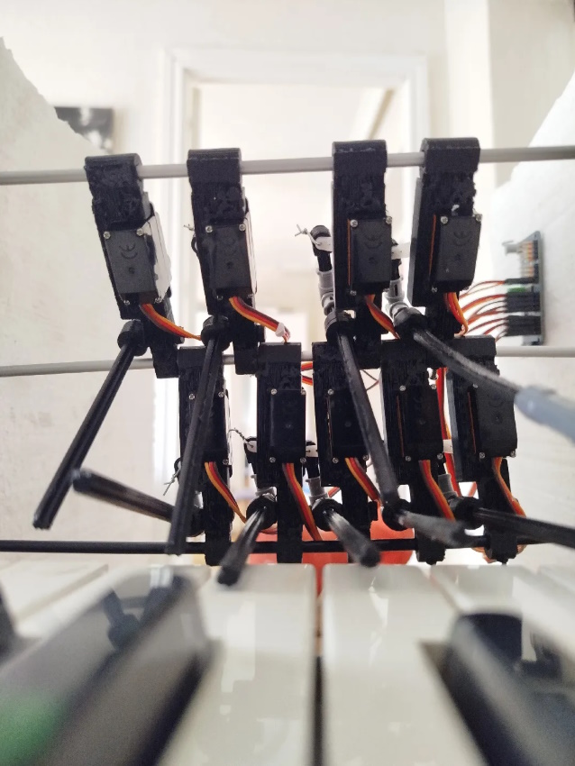
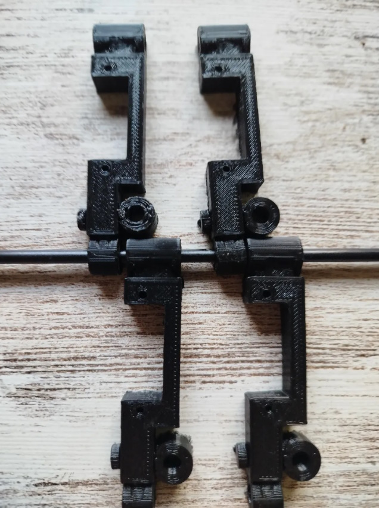
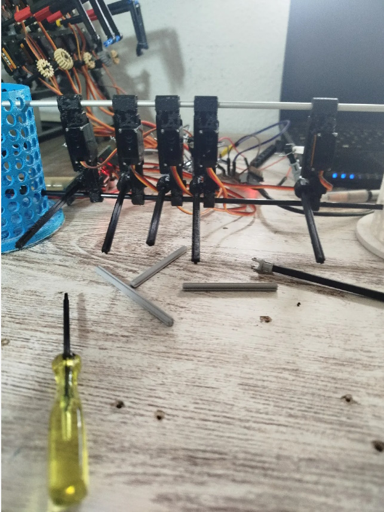
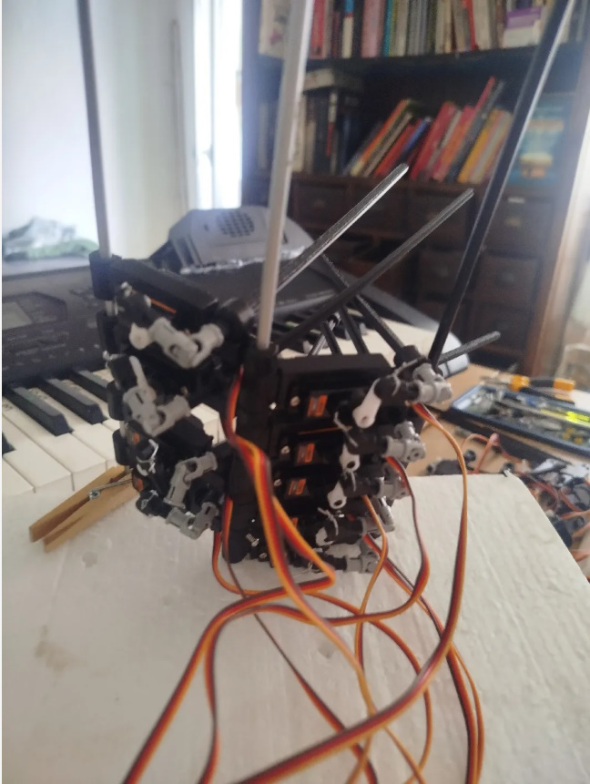

# aTambor 🥁
## Piano Machine Music Robot

**aTambor** es un sistema híbrido de **drum machine automática** que combina software web con hardware de servos para golpear las teclas de un piano en tiempo real. Un proyecto innovador que integra secuenciación digital con percusión mecánica auténtica.

| | | | |
|---|---|---|---|
|  |  |  | |

---

## 📋 Descripción General

aTambor es una máquina de ritmos que:
- 🎛️ **Secuencia patrones rítmicos** mediante interfaz web intuitiva
- 🔊 **Controla hasta 32 servos ES08MA** distribuidos en hasta 2 chips PCA9685
- ⚙️ **Genera sonido auténtico**, no sintetizado — es un instrumento mecánico-digital
- 🎵 **Reproduce archivos MIDI** para crear composiciones completas
- 📱 **Opera desde navegador web** conectado al ESP32 vía WebSocket
- 💰 **Componentes de bajo costo** disponibles en AliExpress — DIY accesible
- 🖨️ **Piezas STL disponibles para descargar** en Printables: [Piano Robot - Synchronized Servo Motion for MIDI Playing](https://www.printables.com/model/1658534-piano-robot-synchronized-servo-motion-for-midi-pla)
- 🔗 **Ver videos en  tiktok :** https://www.tiktok.com/@pot5058
---

## ⚙️ Hardware: Componentes

### Arquitectura del Sistema

```
┌─────────────────────────────┐
│   Interfaz Web (Navegador)  │
│   aTambor.html / midiGrid   │
└──────────────┬──────────────┘
               │ WebSocket (puerto 81)
               ▼
    ┌──────────────────────┐
    │     ESP32 WROOM      │
    │   (Microcontrolador) │
    └──────────┬───────────┘
               │ I2C Bus (2 buses independientes)
               ▼
    ┌────────────────────────────────────────┐
    │  PCA9685 ×1…2  (0x40 en Bus0 y Bus1)  │
    │  Detección automática al arrancar      │
    │  16 canales PWM cada uno → 32 motores  │
    └──────────┬─────────────────────────────┘
               │ Señal PWM
               ▼
    ┌──────────────────────┐
    │   Servos / Solenoides│
    │   (motores 0-31)     │
    └──────────┬───────────┘
               │ Golpe físico
               ▼
    ┌──────────────────────┐
    │  Piano / Instrumento │
    │  (Genera Audio Real) │
    └──────────────────────┘
```

### Firmware: Auto-discovery I2C

El firmware escanea el bus I2C al arrancar y detecta automáticamente qué chips PCA9685 están presentes:

```
PCA[0] found on Bus0 GPIO21/22 (motors 0-15)
PCA[1] found on Bus1 GPIO16/17 (motors 16-31)
Total PCAs: 2 | Active motors: 0-31
```

---

## 🔄 Cómo Funciona el Sistema

### Flujo de Datos

1. **Entrada**: Usuario crea un patrón o carga un archivo MIDI en la interfaz web
2. **Envío**: El navegador envía la secuencia completa al ESP32 vía WebSocket
3. **Procesamiento**: El ESP32 genera una cola de eventos con timestamps precisos
4. **Routing**: motor `N` → chip `N/16`, canal `N%16`
5. **Mecánica**: Los servos se activan en el momento exacto y golpean las teclas
6. **Salida**: El piano genera sonido acústico auténtico

### Protocolo de Comandos (WebSocket → ESP32)

| Comando | Descripción |
|---------|-------------|
| `PLAY\|nombre\|stepMs\n{bloque}` | Enviar secuencia completa y ejecutar |
| `APPEND\n{bloque}` | Añadir movimientos a la cola sin interrumpir |
| `STOP` | Parada inmediata, todos los motores a home |
| `m N;` | Seleccionar motor N |
| `o PWM;` | Fijar posición home del motor (calibración) |
| `t MS;` | Duración del siguiente movimiento (ms) |
| `v VEL;` | Velocidad del golpe (1–100) |
| `p;` | Ejecutar secuencia encolada |
| `e;` | Borrar todas las colas |
| `x;` | Parar reproducción |

---

## 💻 Software

El sistema cuenta con dos entornos de trabajo complementarios.

**→ Ver documentación completa del software:** [README del software](https://github.com/portab76/aTambor/blob/main/html/README.md)

### aTambor — Drum Machine (`aTambor.html`)
Secuenciador paso a paso por canales, al estilo de las clásicas cajas de ritmos. Composición de patrones rítmicos, modo Song, mute por canal y calibración de motores.
🔗 **Demo online:** https://elper.es/aTambor/aTambor.html

### midiGrid — Secuenciador MIDI (`midiGrid.html`)
Piano roll interactivo para reproducir archivos MIDI sobre los motores físicos. Incluye análisis armónico, Motor Map con teclado interactivo, código de colores por octava y edición directa de notas.
🔗 **Demo online:** https://elper.es/aTambor/midiGrid.html

---

## 📝 Stack Tecnológico

| Capa | Tecnología |
|------|-----------|
| Frontend | HTML5, Vanilla JavaScript ES6+ |
| Audio virtual | MIDI.js + SoundFont |
| Comunicación | WebSocket (ESP32 puerto 81) |
| Microcontrolador | ESP32 WROOM |
| Controlador PWM | PCA9685 × 2 (I2C) |
| Actuadores | Servos ES08MA / Solenoides |
| Alimentación | +5V lógica, +5V/+12V actuadores |

---

## 📄 Licencia

GPL — Proyecto Open Source.

## 👤 Autores

Desarrollado como proyecto Music Open Source — drum machine con control web.

## 🤝 Contribuciones

Las mejoras son bienvenidas.

---

*aTambor — donde la secuenciación digital se encuentra con la percusión mecánica.* 🎵🤖
