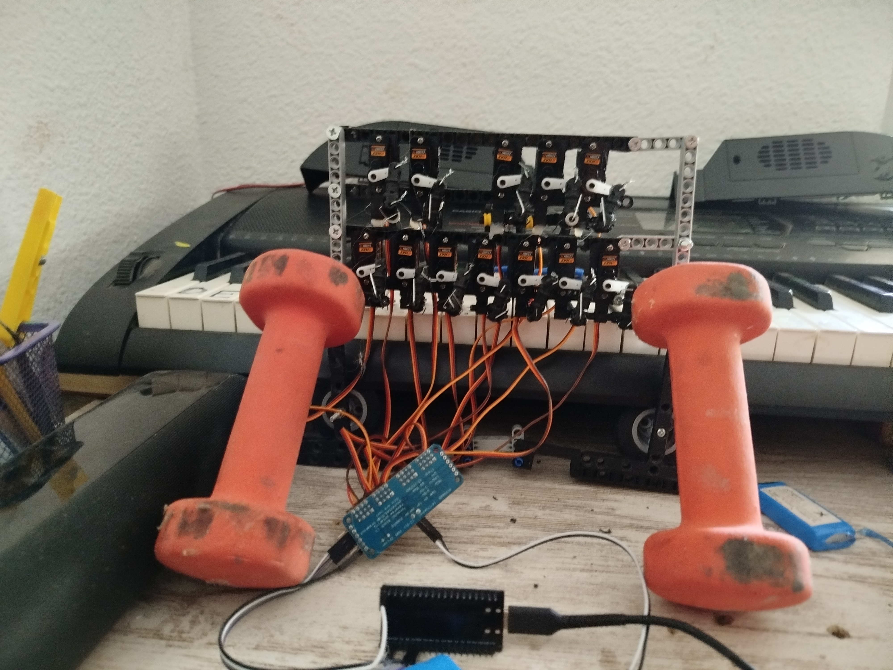
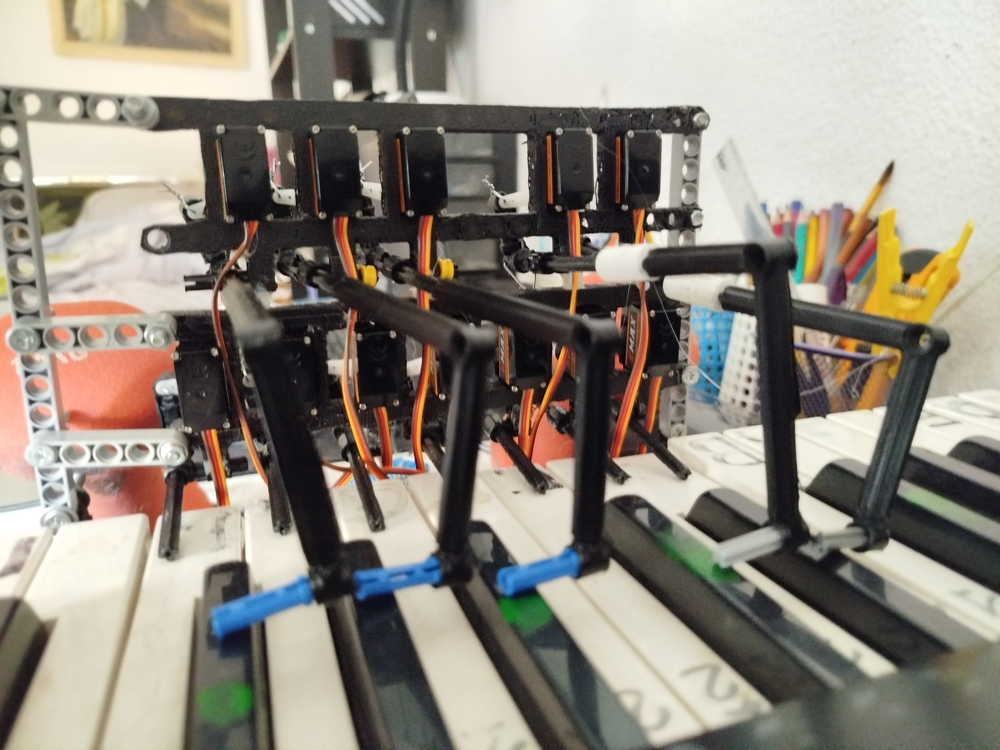
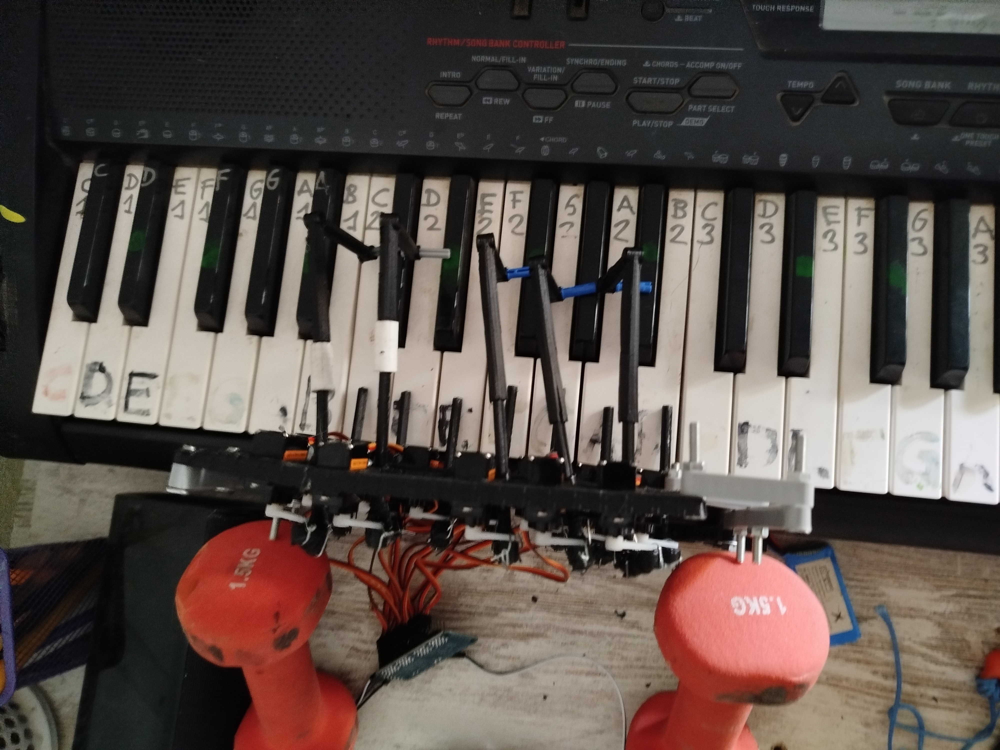

# aTambor 🥁
## Drum Machine Automática Controlada por ESP32

**aTambor** es un sistema híbrido de **drum machine automática** que combina software web con hardware de solenoides para golpear las teclas de un piano en tiempo real. Un proyecto innovador que integra secuenciación digital con percusión mecánica auténtica.



---

## 📋 Descripción General

aTambor es una máquina de ritmos profesional que:
- 🎛️ **Secuencia patrones rítmicos** mediante interfaz web intuitiva
- 🔊 **Controla 12 solenoides** que golpean un teclado MIDI real
- ⚙️ **Genera sonido auténtico**, no sintetizado (es un instrumento mecánico-digital)
- 🎵 **Encadena fragmentos** para crear composiciones completas
- 📱 **Opera desde navegador web** conectado a ESP32 vía WebSocket/Serial

### Casos de uso:
- Música experimental y generativa
- Instalaciones interactivas
- Educación en robótica y música
- Performance en vivo con control automatizado
- Exploración de ritmos complejos y polyrritmia

---

## 🎹 Software: Características

### Secuenciador Visual
- **Matriz de pasos**: Editor visual intuativo de patrones rítmicos
- **Múltiples canales**: Hasta 16 canales independientes (uno por solenoide)
- **Compases configurables**: Soporta 1-8 medidas por patrón
- **Edición en tiempo real**: Modifica patrones mientras se reproduce

### Control de Tempo y Timing
| Control | Rango | Descripción |
|---------|-------|-------------|
| **BPM** | 40-220 | Tempo de reproducción |
| **Measures** | 1-8 | Número de compases en el patrón |

### Instrumentos Virtuales
Piano sintetizado con 14 instrumentos y selección de octavas:
- 🎹 Piano, Piano 2
- 🎵 Arpa, Guitarra, Strings
- 🎼 Xilófono, Marimba, Campana Tubular
- 🎹 Órgano, Órgano 2
- 🎺 Oboe, Clarinete, Flauta

### Formas de Onda
- Sine (senoidal)
- Triangle (triangular)
- Square (cuadrada)
- Sawtooth (diente de sierra)

### Gestión de Patrones
- **Guardar/Cargar**: Exporta patrones en JSON
- **Importar MIDI**: Convierte archivos MIDI a patrones
- **Fragmentos**: Sistema de canciones para encadenar múltiples patrones
- **Repetición**: Control de repeticiones por fragmento
- **Merge**: Fusiona notas consecutivas a valores estándar

### Funcionalidades Avanzadas
- ✅ Selección múltiple de compases
- ✅ Arrastrar y soltar en cola de reproducción
- ✅ Indicadores visuales de reproducción en tiempo real
- ✅ Muting por canal
- ✅ Control de velocidad (volumen) por nota
- ✅ Barra de progreso de canción
- ✅ Sincronización con estado del ESP32

---

## ⚙️ Hardware: Componentes

### Arquitectura del Sistema

```
┌─────────────────────────────┐
│   Interface Web (Navegador) │
│        (aTambor HTML/JS)    │
└──────────────┬──────────────┘
               │ WebSocket/Serial
               ▼
    ┌──────────────────────┐
    │     ESP32 WROOM      │
    │   (Microcontroller)  │
    └──────────┬───────────┘
               │ GPIO Pins
               ▼
    ┌──────────────────────┐
    │  Placa de Control    │
    │ (Relés/Transistores) │
    │   16 Canales         │
    └──────────┬───────────┘
               │ +5V / GND
               ▼
    ┌──────────────────────┐
    │  16 Solenoides       │
    │  + Strikers Rojos    │
    └──────────┬───────────┘
               │ Golpean
               ▼
    ┌──────────────────────┐
    │  Piano - Teclado     │
    │  (Genera Audio Real) │
    └──────────────────────┘
```

### Componentes Principales

| Componente | Cantidad | Función | Notas |
|---|---|---|---|
| **Solenoides** | 16 | Percusores electromagnéticos | Organizados en 2 filas de 8 |
| **Strikers (Mancuernas)** | 2 | Percusores mecánicos rojo naranja | Golpean las teclas MIDI |
| **Placa de Control** | 1 | Transistores/Relés 16 canales | Controla activación de solenoides |
| **Módulo ESP32** | 1 | Microcontrolador principal | Recibe comandos vía web |
| **Teclado MIDI** | 1 | Instrumento de salida | Genera sonido auténtico |
| **Cableado** | Múltiple | Alimentación y datos | Rojo (+5V), Negro (GND), Naranja (Control) |

### Vista Detallada del Hardware






---

## 🎥 Demostración en Video

### Video 1 - Secuenciador y Hardware en Acción

<video width="640" height="480" controls>
  <source src="demos/Video1.mp4" type="video/mp4">
  Tu navegador no soporta videos HTML5
</video>

[📥 Descargar Video 1](demos/Video1.mp4)

### Video 2 - Sistema Completo en Funcionamiento

<video width="640" height="480" controls>
  <source src="demos/Video2.mp4" type="video/mp4">
  Tu navegador no soporta videos HTML5
</video>

[📥 Descargar Video 2](demos/Video2.mp4)

---

## 🔄 Cómo Funciona el Sistema

### Flujo de Datos

1. **Entrada**: Usuario crea patrón en interfaz web
2. **Envío**: Navegador envía comandos al ESP32 vía Serial/WebSocket
3. **Procesamiento**: ESP32 calcula timing basado en BPM
4. **Activación**: Envía pulsos a placa de control
5. **Mecánica**: Solenoides se activan → Strikers golpean teclas MIDI
6. **Salida**: Teclado genera sonido auténtico

### Sincronización Temporal

```
BPM = 120 → Cada beat = 500ms
Secuencia en 1/16 notas = 125ms por paso
Hit Duration = 80ms → Solenoide activo 80ms
Retract = 150ms → Pausa antes siguiente golpe
```

### Características Mecánicas

- **Precisión**: Control en milisegundos del timing de golpe
- **Independencia**: Cada solenoide actúa de forma autónoma
- **Sincronización**: Múltiples solenoides pueden activarse simultáneamente
- **Durabilidad**: Strikers rojos absorben impacto, protegen mecanismo

---

## 🚀 Primeros Pasos

### Requisitos
- ESP32 WROOM con firmware compatible
- Navegador web moderno (Chrome, Firefox, Edge)
- Conexión USB o WiFi al ESP32
- Teclado MIDI conectado al sistema

### Configuración Básica

1. **Acceder a la interfaz web**
   - Abrir `index.html` en navegador
   - Establecer conexión con ESP32

2. **Configurar parámetros globales**
   - Ajustar BPM (defecto: 60)
   - Hit Duration: 80ms (recomendado)
   - Measures: 1-8 según necesidad

3. **Crear patrón**
   - Hacer clic en celdas del secuenciador para activar pasos
   - Ajustar duración de notas manteniendo clicado
   - Escuchar preview con piano virtual

4. **Reproducir**
   - Botón **▶ PLAY**: Inicia reproducción
   - Botón **⏸ PAUSE**: Pausa temporal
   - Botón **■ STOP**: Detiene y reinicia secuencia

---

## 📊 Características Detalladas

### Edición Avanzada de Patrones

**Selección múltiple de compases**
- Click en encabezado de compás para seleccionar
- Barra de herramientas aparece para acciones en lote
- Agregar a cola de reproducción rápidamente

**Sustain (Notas sostenidas)**
- Notas consecutivas se visualizan como barras continuas
- Indica claramente duración de nota larga
- Color degrada para mostrar inicio, medio, fin

**Duración personalizada**
- Control granular en milisegundos
- Merge inteligente: agrupa notas a valores estándar (1/16, 1/8, 1/4)

### Gestión de Fragmentos (Canciones)

```
Patrón 1 (8 beats) ──┐
Patrón 2 (4 beats) ──┼──→ Canción completa
Patrón 1 (8 beats) ──┴──→ (Reproducción secuencial)
```

- **Arrastrar y soltar**: Reordenar patrones en cola
- **Repetición**: Cada patrón se repite N veces configurable
- **Secuencia**: Define orden exacto de reproducción
- **Progreso**: Barra visual muestra avance en canción

### Exportación e Importación

| Formato | Función |
|---------|---------|
| **JSON** | Guardar/cargar patrones personalizados |
| **MIDI** | Importar archivos .mid estándar |
| **Song JSON** | Guardar composición completa con fragmentos |

---

## 🎯 Mejoras Potenciales

### Interfaz y UX
- [ ] Rediseño moderno de UI (actualmente retro/monospace)
- [ ] Tooltips expandibles y tutorial interactivo
- [ ] Indicador de reproducción más prominente (playhead animado)
- [ ] Tema oscuro/claro personalizable

### Funcionalidad
- [ ] **Undo/Redo**: Historial de cambios
- [ ] **Presets**: Guardar configuraciones BPM+instrumentos+forma onda
- [ ] **Atajos de teclado**: Teclas para play, pause, patrón anterior/siguiente
- [ ] **Metrónomo visual/auditivo**: Referencia de tempo
- [ ] **Sync MIDI**: Recibir clock MIDI externo

### Hardware
- [ ] **Sensores de feedback**: Detectar si solenoide activó correctamente
- [ ] **LEDs de estado**: Indicador visual de canales activos
- [ ] **Calibración automática**: Detectar y compensar latencia
- [ ] **Cooling activo**: Para sesiones prolongadas
- [ ] **Aislamiento EMI**: Reducir interferencia electromagnética

### Exportación
- [ ] **MusicXML**: Exportar a notación musical estándar
- [ ] **Standard MIDI File mejorado**: Mejor compatibilidad
- [ ] **Audio WAV/MP3**: Grabar reproducción a archivo
- [ ] **PDF**: Partitura visual de patrón

### Performance
- [ ] Optimizar renderizado para 16+ canales
- [ ] Lazy loading de tabla secuenciador
- [ ] Caché de patrones frecuentes
- [ ] Compresión de datos JSON

---

## 📝 Información Técnica

### Software Stack
- **Frontend**: HTML5, Vanilla JavaScript (ES6+)
- **Audio**: Tone.js 14.8.49 (síntesis Web Audio API)
- **Estilos**: CSS Grid + Flexbox, diseño responsive
- **Comunicación**: WebSocket/Serial para ESP32

### Hardware Stack
- **Microcontrolador**: ESP32 WROOM
- **Actuadores**: 16 Solenoides electromagnéticos
- **Control**: Transistores/Relés MOSFET
- **Interfaz**: Teclado MIDI estándar
- **Alimentación**: +5V, +12V (según solenoides)

### Especificaciones de Rendimiento
- **Resolución temporal**: Milisegundos
- **Latencia mínima**: < 50ms (típico)
- **Polifonía**: 16 canales simultáneos
- **Duración máxima patrón**: 8 compases
- **BPM máximo**: 220 (10 Hz aproximadamente)

### Archivos Principales
```
/html
  ├── index.html      (Interfaz web)
  ├── script.js       (Lógica JavaScript)
  └── style.css       (Estilos - embebidos en HTML)
/demos
  ├── IMG_*.jpg       (Fotos hardware)
  └── Video*.mp4      (Demostraciones en video)
```

---

## 🔧 Troubleshooting

| Problema | Causa Posible | Solución |
|----------|---|---|
| Solenoides no responden | ESP32 no conectado | Verificar conexión USB/WiFi |
| Timing fuera de sincronía | Latencia en comunicación | Reducir BPM, aumentar hit duration |
| Audio MIDI no suena | Teclado no conectado a speakers | Verificar conexión de audio |
| Interfaz no actualiza | WebSocket desconectado | Reconectar ESP32 y recargar navegador |
| Patrón no se guarda | Permisos locales | Usar navegador con permisos de almacenamiento |

---

## 📚 Recursos

- **Tone.js Documentation**: https://tonejs.org
- **ESP32 Pinout**: Verificar en código firmware
- **MIDI Specification**: https://www.midi.org
- **Web Audio API**: https://developer.mozilla.org/en-US/docs/Web/API/Web_Audio_API

---

## 📄 Licencia

Especificar según tus requisitos (MIT, GPL, etc.)

---

## 👤 Autores

Desarrollado como proyecto de drum machine automática con control web.

---

## 🤝 Contribuciones

Las mejoras son bienvenidas. Por favor:
1. Fork el repositorio
2. Crea rama para tu feature
3. Documenta cambios
4. Abre Pull Request

---

**aTambor** - Donde la secuenciación digital se encuentra con la percusión mecánica. 🎵🤖
