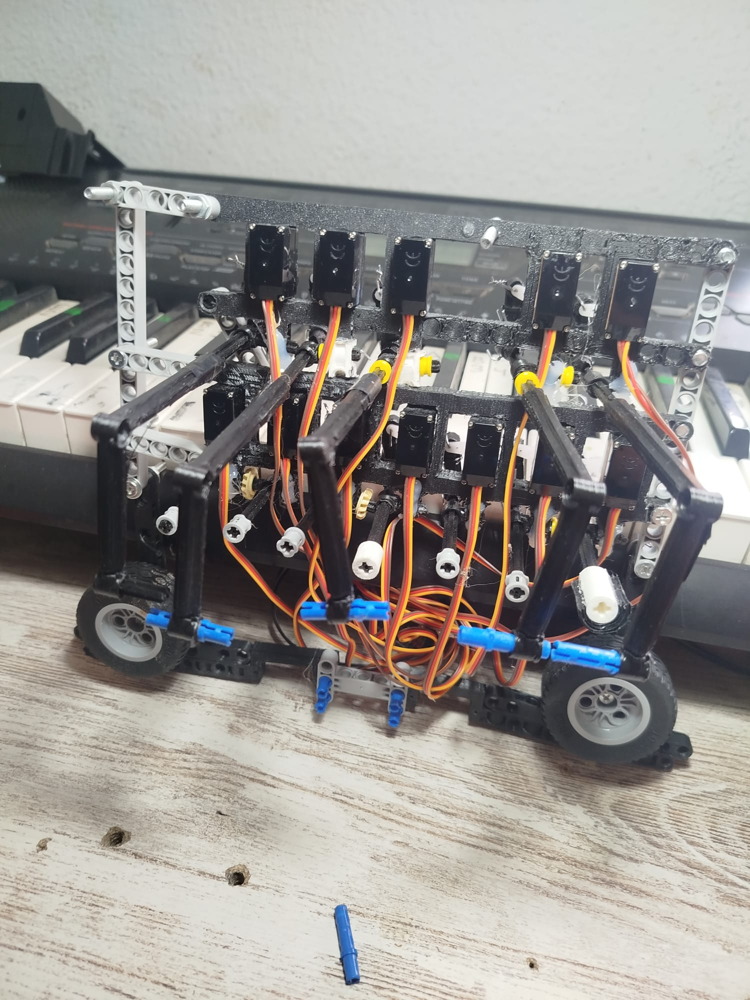
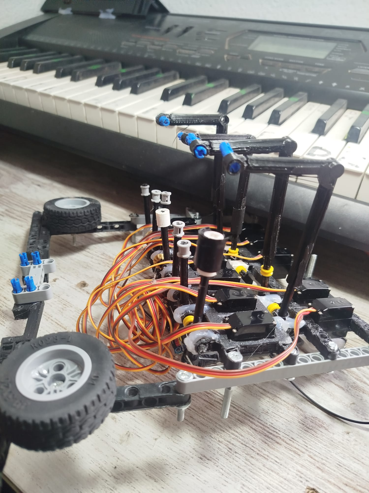

# aTambor 🥁
## Piano Machine Music Robot

**aTambor** es un sistema híbrido de **drum machine automática** que combina software web con hardware de servos para golpear las teclas de un piano en tiempo real. Un proyecto innovador que integra secuenciación digital con percusión mecánica auténtica.

| | | |
|---|---|---|
|  |  |  |

## 📋 Descripción General

aTambor es una máquina de ritmos profesional que:
- 🎛️ **Secuencia patrones rítmicos** mediante interfaz web intuitiva
- 🔊 **Controla hasta 128 servos** distribuidos en hasta 8 chips PCA9685
- ⚙️ **Genera sonido auténtico**, no sintetizado (es un instrumento mecánico-digital)
- 🎵 **Encadena fragmentos** para crear composiciones completas
- 📱 **Opera desde navegador web** conectado a ESP32 vía WebSocket IP
- 💰 **Componentes de bajo costo** disponibles en AliExpress - DIY accesible

## 🎥 Demostración en YouTube

🎬 **[Ver en YouTube Shorts](https://www.youtube.com/shorts/YCQLXMqEDCY)**

Demostración del hardware tocando una copla española tradicional. El archivo utilizado es [`01_Copla.json`](https://github.com/portab76/aTambor/blob/main/Measures/01_Copla.json).

**Análisis Musical:**
- **Tonalidad**: Fa Mayor (modo flamenco)
- **Progresión Armónica**: F → Bb → Eb → Cm (con cromatismos)
- **Estilo**: Copla española tradicional
- **Tempo**: 120 BPM
- **Duración**: 19 compases

---
## 🎹 Software: Características

**Prueba aTambor ahora sin instalación**: https://elper.es/aTambor/ 

Por defecto la interfaz genera sonidos sintetizados directamente en el navegador. El firmware del robot (ESP32 + control de servos) no está publicado. Si te interesa el proyecto completo para uso comercial o personal, contacta conmigo: **portab76@gmail.com**

### Gestión de Patrones
- **Guardar/Cargar**: Exporta patrones en JSON
- **Importar MIDI**: Convierte archivos MIDI a patrones
- **Fragmentos**: Sistema de canciones para encadenar múltiples patrones
- **Repetición**: Control de repeticiones por fragmento
- **Merge**: Fusiona notas consecutivas a valores estándar

### Editor de Grid
- **Scroll vertical**: El grid limita su altura y hace scroll cuando hay muchas filas (p.ej. 30 notas), con cabeceras de compás y numeración siempre visibles
- **Undo** (↩ botón + `Ctrl+Z`): Deshace las últimas 50 acciones (toggle de celda, cambio de duración, pegar, limpiar, borrar compás/beat, añadir fragmento MMLR)
- **Insertar compás** (clic derecho → ➕ Insert Measure): Inserta un compás en blanco antes del compás actual desplazando todo el contenido a la derecha
- **Vista de pentagrama** (Score): Visualización de la secuencia en notación musical con VexFlow y toolbar compacto con dropdowns

### Vista Score (Pentagrama)
Toolbar compacto de una sola fila con dropdowns:
- **Mode**: Add / Delete / Tie
- **Duration**: Whole · Half · Quarter · Eighth · 16th · 32nd · 64th
- **Note**: selección de canal/instrumento
- **Dynamics**: ppp · pp · p · mp · mf · f · ff · fff · sfz
- **Articulation**: staccato · accent · tenuto · marcato · fermata
- **More**: Triplet · Sextuplet · Repeat begin/end
- **Zoom**: − / valor px / +
- **Atajos de teclado**: `A` Add · `D` Delete · `T` Tie · `1-7` duración · `+/-` zoom · `H` Help · `Esc` cerrar dropdown

### GrooveScript (MML-R)
- **Editor integrado**: Sintaxis tipo MML para componer melodías, acordes y patrones rítmicos
- **Importar archivo .txt**: Carga directamente un archivo de texto con sintaxis GrooveScript desde el botón 📂 Import .txt del modal
- **Armonización automática**: Genera acordes diatónicos a partir de una melodía con `@HARMONIZE`
- **Plantillas rápidas**: Melody, Chords, Harmonizing, Groove

### Exportación e Importación

| Formato | Función |
|---------|---------|
| **JSON MEASURE** | Guardar/cargar patrones personalizados |
| **MIDI** | Importar archivos .mid estándar |
| **JSON FRAGMENT** | Guardar composición completa con fragmentos |
| **MMLR / GrooveScript** | Importar/exportar notación textual MML-R |
| **TXT** | Importar scripts GrooveScript desde archivo de texto |


## ⚙️ Hardware: Componentes

**💰 Proyecto de bajo costo**: Todos los componentes son económicos y fáciles de encontrar en plataformas como **AliExpress**, lo que lo hace accesible para makers, estudiantes y entusiastas de la robótica.

### Arquitectura del Sistema

```
┌─────────────────────────────┐
│   Interface Web (Navegador) │
│        (aTambor HTML/JS)    │
└──────────────┬──────────────┘
               │ WebSocket/IP
               ▼
    ┌──────────────────────┐
    │     ESP32 WROOM      │
    │   (Microcontroller)  │
    └──────────┬───────────┘
               │ I2C Bus (SDA/SCL)
               ▼
    ┌────────────────────────────────────────┐
    │  PCA9685  ×1…8  (I2C 0x40…0x47)        │
    │  Auto-detected at boot                 │
    │  16 PWM channels each → up to 128 total│
    └──────────┬─────────────────────────────┘
               │ PWM signal
               ▼
    ┌──────────────────────┐
    │  Solenoids / Servos  │
    │  (motor index 0-127) │
    └──────────┬───────────┘
               │ Strike
               ▼
    ┌──────────────────────┐
    │  Piano - Físico      │
    │  (Genera Audio Real) │
    └──────────────────────┘
```

### Configuración de Motores: `DEFAULT_KEYS`

`DEFAULT_KEYS` en `script.js` es el **único lugar donde se define** qué notas hay y a qué motor van. Añadir o quitar motores solo requiere editar este array — el firmware **no necesita recompilarse**.

```javascript
const DEFAULT_KEYS = [
  // ── PCA 0  (I2C 0x40) ─────────────────────────────────────
  { name: 'C1',  pca: 0, motor: 0  },
  { name: 'C#1', pca: 0, motor: 1  },
  // ...hasta motor 15

  // ── PCA 1  (I2C 0x41) — descomentar cuando el hardware esté listo
  // { name: 'C2',  pca: 1, motor: 16 },
  // ...
];

const MAX_CH  = DEFAULT_KEYS.length;   // derivado automáticamente
const NUM_PCA = new Set(DEFAULT_KEYS.map(k => k.pca)).size;
```

| Campo  | Descripción |
|--------|-------------|
| `name` | Nombre de la nota (label en la UI) |
| `pca`  | Índice del chip PCA9685 (dirección I2C = `0x40 + pca`) |
| `motor`| Índice global enviado al firmware (`m N;`). El firmware calcula: `chip = motor/16`, `canal = motor%16` |

**Para añadir un PCA**: descomentar las entradas correspondientes — no hay nada más que cambiar.

### Firmware: Auto-discovery I2C

El firmware escanea el bus I2C al arrancar y detecta automáticamente qué chips PCA9685 están presentes:

```
PCA[0] found @ 0x40 (motors 0-15)
PCA[1] found @ 0x41 (motors 16-31)
Total PCAs: 2 | Active motor range: 0-31
```

- Hasta **8 chips** soportados (0x40–0x47)
- **16 canales por chip** — sin restricciones de software
- Memoria de colas **dinámica**: solo se asigna RAM cuando un motor recibe su primer comando
- Motores no presentes → warning en log, sin crash

### Vista Detallada del Hardware


---

## 🔄 Cómo Funciona el Sistema

### Flujo de Datos

1. **Entrada**: Usuario crea patrón en interfaz web
2. **Envío**: Navegador envía comandos al ESP32 vía IP/WebSocket
3. **Procesamiento**: ESP32 calcula timing basado en BPM
4. **Routing**: `motor N` → chip `N/16`, canal `N%16`
5. **Mecánica**: Solenoides/servos se activan → Strikers golpean teclas
6. **Salida**: Piano genera sonido auténtico

### Protocolo de Comandos (WebSocket)

| Comando   | Descripción |
|-----------|-------------|
| `m N;`    | Seleccionar motor N |
| `t MS;`   | Duración del golpe en milisegundos |
| `v VEL;`  | Velocidad (intensidad del golpe) |
| `o PWM;`  | Posición PWM directa (calibración) |
| `p;`      | Play secuencia |
| `e;`      | Stop |
| `r;`      | Repetir |
| `STOP`    | Parar todos los motores |
| `SETLIVE` | Modo live (respuesta inmediata) |

### Sincronización Temporal

```
BPM = 120 → Cada beat = 500ms
Secuencia en 1/16 notas = 125ms por paso
Hit Duration = 80ms → Solenoide activo 80ms
Retract = 150ms → Pausa antes siguiente golpe
```

---

## 📝 Información Técnica

### Software Stack
- **Frontend**: HTML5, Vanilla JavaScript (ES6+)
- **Notación musical**: VexFlow (vista Score/pentagrama)
- **Audio**: Tone.js 14.8.49 (síntesis Web Audio API)
- **Estilos**: CSS Grid + Flexbox, diseño responsive
- **Comunicación**: WebSocket/HTTP para ESP32

### Hardware Stack
- **Microcontrolador**: ESP32 WROOM
- **Controlador PWM I2C**: PCA9685 (hasta 8 chips, direcciones 0x40–0x47)
- **Actuadores**: Solenoides / Servo motores
- **Interfaz**: Piano con teclado estándar o cualquier instrumento musical
- **Alimentación**: +5V (lógica), +5V/+12V (servos/solenoides según modelo)

## 📚 Recursos

- **Tone.js Documentation**: https://tonejs.org
- **VexFlow**: https://vexflow.com
- **PCA9685 Datasheet**: https://www.nxp.com/docs/en/data-sheet/PCA9685.pdf
- **Adafruit PWMServoDriver**: https://github.com/adafruit/Adafruit-PWM-Servo-Driver-Library
- **MIDI Specification**: https://www.midi.org
- **Web Audio API**: https://developer.mozilla.org/en-US/docs/Web/API/Web_Audio_API

## 📄 Licencia GPL


## 👤 Autores

Desarrollado como proyecto Music Open Source drum machine con control web.

## 🤝 Contribuciones

Las mejoras son bienvenidas.

**aTambor** - Donde la secuenciación digital se encuentra con la percusión mecánica. 🎵🤖
