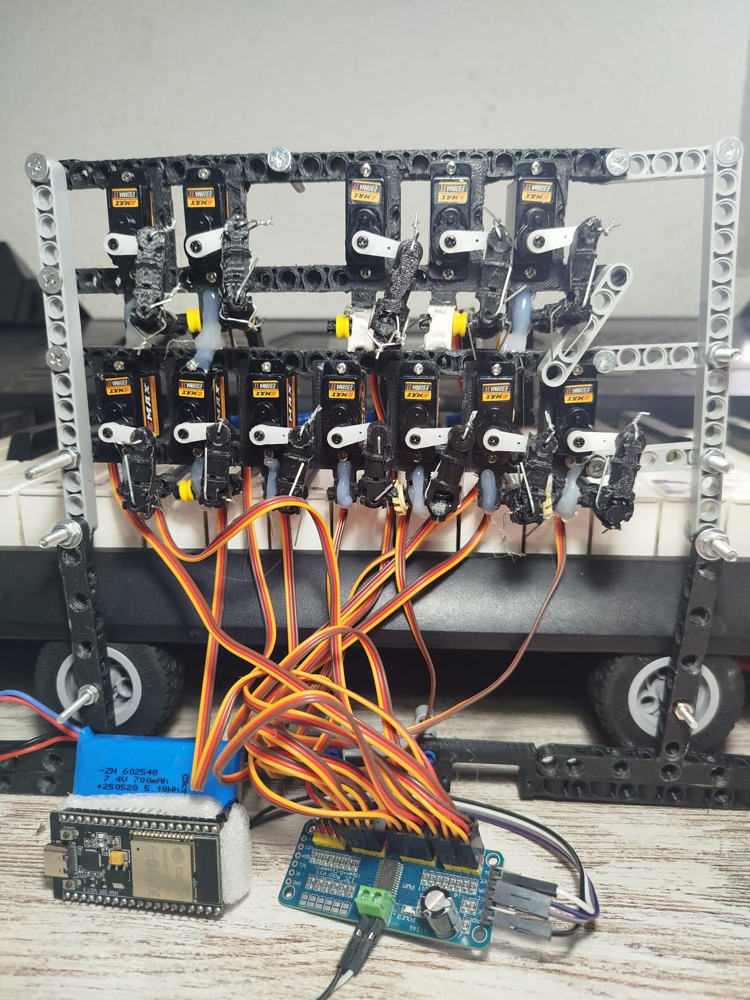
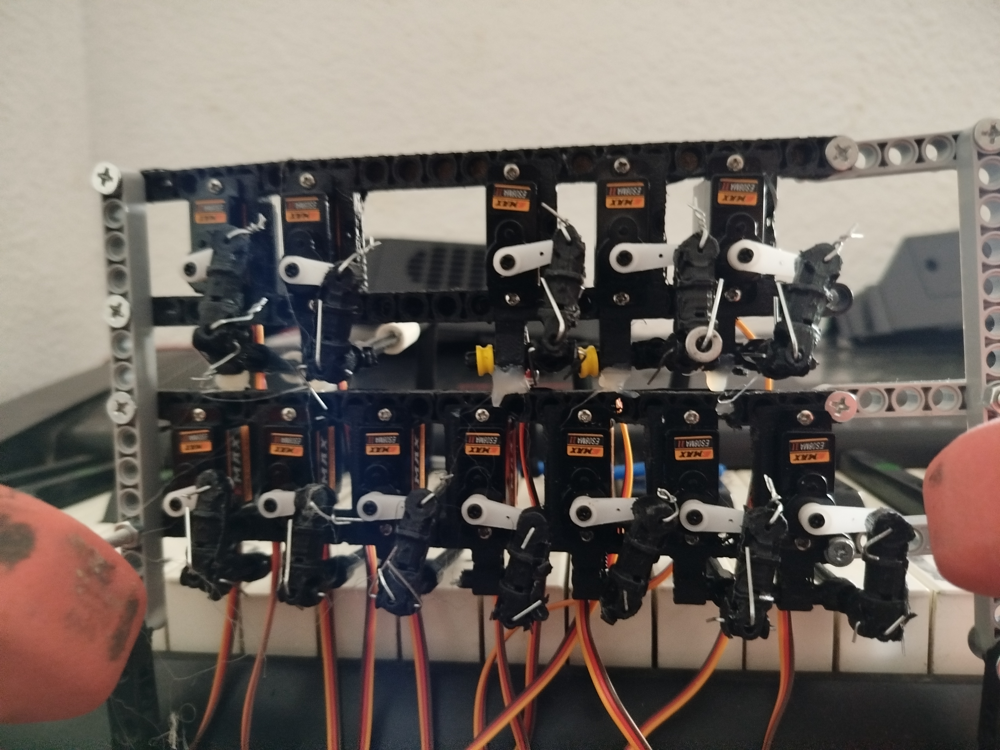

# aTambor 🥁
## Piano Machine Music Robot

**aTambor** es un sistema híbrido de **drum machine automática** que combina software web con hardware de solenoides para golpear las teclas de un piano en tiempo real. Un proyecto innovador que integra secuenciación digital con percusión mecánica auténtica.



## 📋 Descripción General

aTambor es una máquina de ritmos profesional que:
- 🎛️ **Secuencia patrones rítmicos** mediante interfaz web intuitiva
- 🔊 **Controla 12 servos solenoides** que golpean un piano real
- ⚙️ **Genera sonido auténtico**, no sintetizado (es un instrumento mecánico-digital)
- 🎵 **Encadena fragmentos** para crear composiciones completas
- 📱 **Opera desde navegador web** conectado a ESP32 vía WebSocket IP

## 🎥 Demostración en YouTube

🎬 **[Ver en YouTube Shorts](https://www.youtube.com/shorts/YCQLXMqEDCY)**

Demostración del hardware tocando una copla española tradicional. El archivo utilizado es [`01_Copla.json`](https://github.com/portab76/aTambor/blob/main/Measures/01_Copla.json).

**Análisis Musical:**
- **Tonalidad**: Fa Mayor (modo flamenco)
- **Progresión Armónica**: F → Bb → Eb → Cm (con cromatismos)
- **Estilo**: Copla española tradicional
- **Tempo**: 120 BPM
- **Duración**: 19 compases

---
## 🎹 Software: Características

**Prueba aTambor ahora sin instalación**: https://elper.es/aTambor/ 

Por defecto la interfaz genera sonidos sintetizados directamente en el navegador. El firmware del robot (ESP32 + control de servos) no está publicado. Si te interesa el proyecto completo para uso comercial o personal, contacta conmigo: **portab76@gmail.com**

### Gestión de Patrones
- **Guardar/Cargar**: Exporta patrones en JSON
- **Importar MIDI**: Convierte archivos MIDI a patrones
- **Fragmentos**: Sistema de canciones para encadenar múltiples patrones
- **Repetición**: Control de repeticiones por fragmento
- **Merge**: Fusiona notas consecutivas a valores estándar


## ⚙️ Hardware: Componentes

### Arquitectura del Sistema

```
┌─────────────────────────────┐
│   Interface Web (Navegador) │
│        (aTambor HTML/JS)    │
└──────────────┬──────────────┘
               │ WebSocket/IP
               ▼
    ┌──────────────────────┐
    │     ESP32 WROOM      │
    │   (Microcontroller)  │
    └──────────┬───────────┘
               │ GPIO Pins
               ▼
    ┌──────────────────────┐
    │  Placa de Control    │
    │ (Relés/Transistores) │
    │   16 Canales         │
    └──────────┬───────────┘
               │ +5V / GND
               ▼
    ┌──────────────────────┐
    │  16 Solenoides       │
    └──────────┬───────────┘
               │ Golpean
               ▼
    ┌──────────────────────┐
    │  Piano - Físico      │
    │  (Genera Audio Real) │
    └──────────────────────┘
```

### Vista Detallada del Hardware




---

## 🔄 Cómo Funciona el Sistema

### Flujo de Datos

1. **Entrada**: Usuario crea patrón en interfaz web
2. **Envío**: Navegador envía comandos al ESP32 vía IP/WebSocket
3. **Procesamiento**: ESP32 calcula timing basado en BPM
4. **Activación**: Envía pulsos a placa de control
5. **Mecánica**: Solenoides se activan → Strikers golpean teclas MIDI
6. **Salida**: Teclado genera sonido auténtico

### Sincronización Temporal

```
BPM = 120 → Cada beat = 500ms
Secuencia en 1/16 notas = 125ms por paso
Hit Duration = 80ms → Solenoide activo 80ms
Retract = 150ms → Pausa antes siguiente golpe
```

### Características Mecánicas

- **Precisión**: Control en milisegundos del timing de golpe
- **Independencia**: Cada solenoide actúa de forma autónoma
- **Sincronización**: Múltiples solenoides pueden activarse simultáneamente

---

### Exportación e Importación

| Formato | Función |
|---------|---------|
| **JSON** | Guardar/cargar patrones personalizados |
| **MIDI** | Importar archivos .mid estándar |
| **Song JSON** | Guardar composición completa con fragmentos |

## 📝 Información Técnica

### Software Stack
- **Frontend**: HTML5, Vanilla JavaScript (ES6+)
- **Audio**: Tone.js 14.8.49 (síntesis Web Audio API)
- **Estilos**: CSS Grid + Flexbox, diseño responsive
- **Comunicación**: WebSocket/Serial para ESP32

### Hardware Stack
- **Microcontrolador**: ESP32 WROOM 
- **Controlador Servor I2C**: ICP9685
- **Control**: Seloides Servo motores 
- **Interfaz**: Piano con Teclado estándar o instrumento musical. 
- **Alimentación**: +5V, +12V (según solenoides)

## 📚 Recursos

- **Tone.js Documentation**: https://tonejs.org
- **ESP32 Pinout**: Verificar en código firmware
- **MIDI Specification**: https://www.midi.org
- **Web Audio API**: https://developer.mozilla.org/en-US/docs/Web/API/Web_Audio_API

## 📄 Licencia GPL


## 👤 Autores

Desarrollado como proyecto Music Open Source drum machine con control web.

## 🤝 Contribuciones

Las mejoras son bienvenidas.

**aTambor** - Donde la secuenciación digital se encuentra con la percusión mecánica. 🎵🤖
