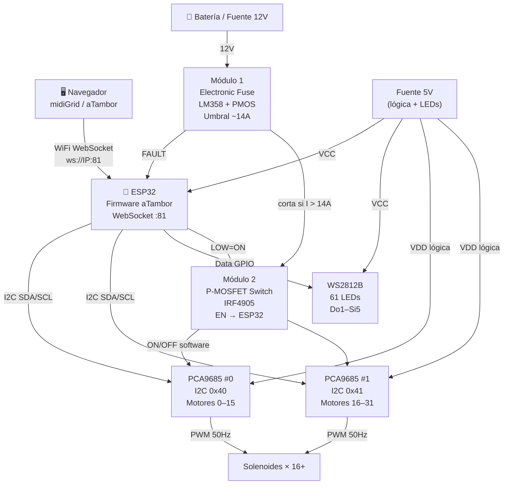

# aTambor — Sistema de Percusión Robótica

**aTambor** es un sistema de composición y reproducción musical para instrumentos de percusión físicos controlados por servomotores y solenoides a través de un microcontrolador ESP32. Combina una interfaz web con hardware real, permitiendo que una máquina toque música con precisión y expresividad.

El sistema cuenta con dos entornos de trabajo complementarios:

---

## 🥁 aTambor — Drum Machine

🔗 **Demo online:** https://elper.es/aTambor/aTambor.html  
**Archivo:** `aTambor.html`

Entorno orientado a la **composición de ritmos por canales**, al estilo de las clásicas cajas de ritmos (drum machines).

### Características

- **Secuenciador paso a paso** con cuadrícula de pasos activables por canal
- **Múltiples canales de percusión** independientes, cada uno asignado a un motor físico
- **Control de tempo (BPM)** ajustable en tiempo real
- **Patrones de compás** editables: añadir, eliminar y reordenar compases
- **Modo Song**: encadena patrones en una secuencia de canción completa
- **Notas sostenidas**: duración variable por paso (golpe, medio, largo)
- **Mute por canal**: silenciar canales individuales durante la reproducción
- **Calibración de motores**: ajuste fino de posición y velocidad por canal
- **Test de golpe** individual por canal
- **Sincronización con ESP32** vía WebSocket — los motores físicos se mueven en tiempo real
- **Modo loop** y control de reproducción (play / pause / stop)

---

## 🎹 midiGrid — Secuenciador MIDI con Piano Roll

🔗 **Demo online:** https://elper.es/aTambor/midiGrid.html  
**Archivo:** `midiGrid.html`

Entorno orientado a la **reproducción de archivos MIDI** sobre los motores físicos, con visualización de piano roll, análisis armónico y control avanzado del hardware.

### Carga y navegación

- **Carga de archivos MIDI** (.mid / .midi) mediante botón, menú o arrastre directo al navegador
- **Selección de canal**: selector de instrumento/canal con botón **Mostrar** — si el tab activo ya tiene contenido, abre el canal en un tab nuevo automáticamente
- **Todos (Ctrl+Shift+A)**: abre cada canal del MIDI en un tab independiente con un solo clic
- **Sistema de tabs multi-documento**: cada tab es un proyecto independiente con su propio grid, historial undo/redo y análisis armónico. Al cambiar de tab durante la reproducción, la música continúa en el nuevo tab
- **Archivos recientes**: historial de los últimos archivos cargados con acceso rápido desde el menú

### Piano roll

- **Piano roll interactivo** con zoom ajustable (teclas −/+), scroll horizontal y vertical sincronizado
- **Edición directa de notas**: click para añadir/quitar, arrastrar para ajustar duración
- **Ctrl+Click**: editar velocity de una nota individual
- **Alt+Click**: mutear/desmutear el motor asociado a esa nota — la nota aparece en gris con raya diagonal roja
- **Shift+arrastrar**: selección rectangular de notas (borrar con Delete, copiar con Ctrl+C)
- **Minimap panorámico**: vista comprimida de toda la canción con indicador de posición
- **Regla de compases tipo DAW**: seek por clic, marcadores A-B, puntos de tempo editables
- **Carril de velocidades**: editar velocity nota a nota; **Shift+arrastrar** aplica la misma velocity a todas las notas a la vez
- **Historial Undo/Redo** (Ctrl+Z / Ctrl+Y) con 50 pasos por tab

### Reproducción y transporte

- **Play / Pause / Stop** con sincronización ESP32
- **Loop A→B**: marcar inicio y fin en la regla para repetir un fragmento
- **Mapa de tempo editable**: puntos de BPM en la regla para crear aceleraciones y ralentizaciones
- **Streaming predictivo**: envía la secuencia al ESP32 en bloques mientras suena

### Panel Motor Map + Escala

El botón **Motor** abre un panel único con dos secciones visibles:

**🎹 Escala — Transposición global**
- Slider −32…+24 semitonos con botones de salto rápido y reset; offset global entre todos los tabs
- Checkbox "Solo motores" y ajuste de Vel. mín/máx al importar MIDI

**⚙ Motor Map — Mapeo nota → motor físico**
- Tabla MIDI → motor → HomePWM → PCA/ch → Mute con teclado miniatura
- Mute por fila: silencia altavoces y ESP32 simultáneamente
- Test de motor individual, Export/Import JSON
- LEDs WS2812B: modos arcoíris, octava, calor y blanco
- **Avance LED** (slider en el menú): LED rojo N ms antes del golpe (Synthesia)

### Análisis armónico

- Detección automática de tonalidad, grados y acordes por segmento
- **Chord row** sincronizada con el piano roll en cuatro niveles: pasos, acordes, frases, respiración
- **Auto-avance (▶▶ Auto)**: encadena segmentos automáticamente con espera de confirmación ESP32

### Conexión ESP32

- **WiFi** (WebSocket ws://IP:81) o **Serie** (Web Serial API USB-CDC)
- Indicador de estado ●, ventana de log en tiempo real, consola de comandos directos

---

## 📁 Estructura del proyecto

```
PianoRoll/
├── midiGrid.html          # Piano roll / secuenciador MIDI
├── aTambor.html           # Drum machine
├── js/
│   ├── state.js           # Variables globales compartidas
│   ├── midi-parser.js     # Lectura y parseo de archivos MIDI
│   ├── piano-roll.js      # Renderizado del canvas y teclado lateral
│   ├── editor.js          # Edición interactiva del grid
│   ├── playback.js        # Motor de reproducción paso a paso
│   ├── timeline-ruler.js  # Regla de compases tipo DAW
│   ├── harmonic.js        # Análisis armónico y detección de tonalidad
│   ├── chord-row.js       # Chord row y auto-avance
│   ├── motor-map.js       # Mapeo nota MIDI → motor físico + LEDs
│   ├── esp32-sequencer.js # Construcción de secuencias para ESP32
│   ├── tabs.js            # Sistema de pestañas multi-documento
│   ├── transpose.js       # Panel de transposición global
│   ├── heat.js            # Motor de Atención (mapa de calor)
│   ├── velocity-lane.js   # Carril de velocidades
│   ├── minimap.js         # Minimap panorámico
│   ├── history.js         # Historial undo/redo
│   ├── persistence.js     # Guardar/cargar proyectos JSON
│   ├── ws-connector.js    # Conexión WebSocket ESP32
│   ├── serial-connector.js# Conexión Serie (Web Serial API)
│   └── midiGrid.js        # Punto de entrada y cableado de eventos
└── MIDI.js/               # Librería de reproducción MIDI + SoundFont
```

---

## 🚀 Puesta en marcha

1. Servir los archivos desde un servidor local (ej: XAMPP → `localhost/PianoRoll/`)
2. Abrir `midiGrid.html` o `aTambor.html` en el navegador
3. Conectar el ESP32 a la misma red WiFi, anotar su IP
4. Introducir la IP en el campo ESP32 y pulsar **Conectar**
5. Cargar un archivo MIDI (botón 🎵 o arrastrarlo a la ventana)
6. Seleccionar canal → **Mostrar** (o **Todos** para abrir todos los instrumentos)
7. Pulsar **▶ Play**

---

---

# ⚙️ Hardware

---

## Componentes requeridos

- **ESP32** con firmware aTambor (WebSocket en puerto 81)
- **PCA9685** × 2 (controladores PWM I2C): 32 motores en total
- **Servomotores o solenoides** × hasta 32
- **Strip LED WS2812B** de 61 LEDs (Do1–Si5 cromático)
- **Módulo Electronic Fuse** (protección sobrecorriente)
- **Módulo P-MOSFET High-Side Switch** (corte por software)
- **Fuente 5V** (lógica + LEDs) y **fuente/batería 12V** (solenoides)

---

## Diagrama de bloques del sistema


```mermaid
graph TD
    Browser["🖥️ Navegador\nmidiGrid / aTambor"]
    ESP["🔲 ESP32\nFirmware aTambor\nWebSocket :81"]
    FUSE["Módulo 1\nElectronic Fuse\nLM358 + PMOS\nUmbral ~14A"]
    SW["Módulo 2\nP-MOSFET Switch\nIRF4905\nEN → ESP32"]
    PCA0["PCA9685 #0\nI2C 0x40\nMotores 0–15"]
    PCA1["PCA9685 #1\nI2C 0x41\nMotores 16–31"]
    LED["WS2812B\n61 LEDs\nDo1–Si5"]
    SOL["Solenoides × 16+"]
    BAT["🔋 Batería / Fuente 12V"]
    PWR5["Fuente 5V\n(lógica + LEDs)"]

    Browser -->|"WiFi WebSocket\nws://IP:81"| ESP
    ESP -->|I2C SDA/SCL| PCA0
    ESP -->|I2C SDA/SCL| PCA1
    ESP -->|Data GPIO| LED
    ESP -->|"LOW=ON"| SW
    FUSE -->|"FAULT"| ESP
    BAT -->|12V| FUSE
    FUSE -->|"corta si I > 14A"| SW
    SW -->|"ON/OFF software"| PCA0
    SW --> PCA1
    PCA0 -->|PWM 50Hz| SOL
    PCA1 -->|PWM 50Hz| SOL
    PWR5 -->|VCC| ESP
    PWR5 -->|VCC| LED
    PWR5 -->|VDD lógica| PCA0
    PWR5 -->|VDD lógica| PCA1
```

---

## Pines ESP32

| Pin ESP32     | Señal        | Destino                   | Notas                        |
|---------------|--------------|---------------------------|------------------------------|
| GPIO **TODO** | I2C SDA      | PCA9685 #0 + #1 SDA       | Bus I2C compartido           |
| GPIO **TODO** | I2C SCL      | PCA9685 #0 + #1 SCL       | Bus I2C compartido           |
| GPIO **TODO** | WS2812B Data | LED strip DIN             | Resistencia 330Ω en serie    |
| GPIO **TODO** | P-MOSFET EN  | Módulo switch (activo LOW)| LOW = solenoides ON          |
| GPIO **TODO** | FAULT IN     | Módulo fuse (si dispone)  | HIGH = sobrecorriente        |
| GPIO **TODO** | LED onboard  | LED estado WiFi           |                              |
| 3V3           | VCC lógica   | PCA9685 VDD               | No alimentar motores con 3V3 |
| GND           | Masa común   | PCA9685 GND · LED GND     |                              |

> ⚠️ **Completa los números GPIO** según tu esquemático del firmware.

---

## PCA9685 — Configuración I2C

| Chip        | Dirección I2C | Motores | Canales PWM |
|-------------|---------------|---------|-------------|
| PCA9685 #0  | `0x40`        | 0 – 15  | ch 0 – 15   |
| PCA9685 #1  | `0x41`        | 16 – 31 | ch 0 – 15   |

Jumpers de dirección (A0–A5 en la placa):

| Chip    | A0  | A1  | A2  | A3  | A4  | A5  |
|---------|-----|-----|-----|-----|-----|-----|
| PCA #0  | GND | GND | GND | GND | GND | GND |
| PCA #1  | VCC | GND | GND | GND | GND | GND |

Parámetros PWM: **50 Hz** · HomePWM reposo: **375** (≈ 1,46 ms)  
Routing firmware: `PCA = motor ÷ 16` · `canal = motor mod 16`

---

## Motor Map — Nota MIDI → motor físico

| Nota | MIDI | Motor | PCA | Ch | Color      |
|------|------|-------|-----|----|------------|
| A1   | 33   | 12    | 0   | 12 | 🔴 rojo    |
| B1   | 35   | 13    | 0   | 13 | 🔴 rojo    |
| C2   | 36   | 0     | 0   | 0  | 🟠 naranja |
| C#2  | 37   | 10    | 0   | 10 | 🟠 naranja |
| D2   | 38   | 1     | 0   | 1  | 🟠 naranja |
| D#2  | 39   | 11    | 0   | 11 | 🟠 naranja |
| E2   | 40   | 2     | 0   | 2  | 🟠 naranja |
| F2   | 41   | 3     | 0   | 3  | 🟠 naranja |
| F#2  | 42   | 7     | 0   | 7  | 🟠 naranja |
| G2   | 43   | 4     | 0   | 4  | 🟠 naranja |
| G#2  | 44   | 8     | 0   | 8  | 🟠 naranja |
| A2   | 45   | 5     | 0   | 5  | 🟠 naranja |
| A#2  | 46   | 9     | 0   | 9  | 🟠 naranja |
| B2   | 47   | 6     | 0   | 6  | 🟠 naranja |
| C3   | 48   | 14    | 0   | 14 | 🟡 amarillo|
| D3   | 50   | 15    | 0   | 15 | 🟡 amarillo|

---

## Strip LED WS2812B

| Parámetro      | Valor                                        |
|----------------|----------------------------------------------|
| Número de LEDs | 61                                           |
| Rango          | LED 0 (sin motor) → LED 60 (Si5)            |
| Nota base      | C1 (MIDI 24) = LED 1                         |
| Fórmula índice | `ledIdx = MIDI_note − 23`                    |
| Protocolo      | WS2812B (NeoPixel) 800 kHz                   |
| Alimentación   | 5V independiente para >10 LEDs simultáneos   |
| Resistencia    | 330 Ω en serie en el pin Data                |
| Condensador    | 100–1000 µF entre VCC y GND del strip        |

**Modos de color** (configurables desde la UI): Octava · Arcoíris · Calor · Blanco  
**LED de anticipación**: rojo (hue FastLED = 0), N ms antes del golpe — configurable con el slider *Avance* del menú.

---

## Protección de solenoides — Módulos P-MOSFET

### Esquema de conexión

```
BATERÍA 12V (+)
       │
       ▼
┌─────────────────────────────────┐
│  MÓDULO 1 — Electronic Fuse     │
│  LM358 + P-MOSFET + pot         │
│  Buscar: "adjustable overcurrent│
│  protection module DC 12V"      │
│  Ajustar umbral: ~14-15A        │
└────────────┬──────────┬─────────┘
             │          │
        corta auto   FAULT ──► ESP32 GPIO
             │
             ▼
┌─────────────────────────────────┐
│  MÓDULO 2 — P-MOSFET Switch     │
│  IRF4905 / IRF9540 + driver     │
│  Buscar: "PMOS high side switch │
│  module 15A 12V"                │
│  EN ──► ESP32 GPIO (LOW = ON)   │
└────────────┬────────────────────┘
             │
             ▼
     V+ PCA9685 #0 y #1
     (alimentación solenoides)

BATERÍA 12V (−) ──────────────────► GND PCA9685 (masa común)
```

### Conexión al ESP32

| Módulo           | Pin módulo | ESP32         | Lógica                   |
|------------------|-----------|---------------|--------------------------|
| P-MOSFET switch  | EN / Gate | GPIO **TODO** | LOW = ON · HIGH = OFF    |
| Electronic fuse  | FAULT     | GPIO **TODO** | HIGH = sobrecorriente    |

### Qué buscar en AliExpress

| Módulo           | Términos de búsqueda                                    | Precio  |
|------------------|---------------------------------------------------------|---------|
| Electronic fuse  | `adjustable overcurrent protection module 12V LM358`   | 1–3 €   |
| P-MOSFET switch  | `PMOS high side switch module 15A` · `P channel MOSFET trigger board` | 1–2 € |

### Especificaciones mínimas

| Parámetro          | Mínimo                              |
|--------------------|-------------------------------------|
| Tensión de entrada | ≥ 15V                               |
| Corriente continua | ≥ 10A                               |
| Corriente de pico  | ≥ 20A                               |
| MOSFET             | IRF4905 · IRF9540 · IRF3205P        |

### Protección adicional por canal

```
V+ ──[PTC 1A MF-R110]──[solenoide]──┐
                                    │
                [1N4007 ←]──────────┘  (cátodo → V+)
                     │
                    GND
```

PTC rearmable por canal + diodo flyback 1N4007 en cada solenoide.

---

## Esquema de alimentación

```
Fuente 5V  ──┬──► ESP32
             ├──► PCA9685 VDD (lógica)
             └──► WS2812B VCC

Batería 12V ─┬──► [Módulo fuse] → [Módulo MOSFET] → PCA9685 V+ (solenoides)
             └──► GND común con fuente 5V  ⚠️
```

> ⚠️ **Masa común obligatoria** entre fuente 5V y batería 12V.  
> ⚠️ **No conectar** los 12V al VDD del PCA9685 ni al ESP32.  
> ⚠️ **Condensadores de desacople** 100µF cerca de cada PCA9685.

---

## Protocolo ESP32 ↔ Navegador

**WebSocket** puerto 81 · `ws://IP:81`  
**Serie** Web Serial API (USB-CDC)

### Comandos del navegador → ESP32

| Comando  | Formato | Descripción |
|----------|---------|-------------|
| `PLAY`   | `PLAY\|midiGrid\|<stepMs>\|<advMs>\|<advHue>\n<seq>` | Cargar y ejecutar secuencia |
| `APPEND` | `APPEND\n<seq>` | Encolar bloque siguiente |
| `STOP`   | `STOP` | Detener reproducción |
| `p;`     | `p;`   | Arrancar secuencia cargada (WS) |

### Instrucciones de secuencia

| Instrucción  | Ejemplo          | Descripción |
|--------------|------------------|-------------|
| `e;`         | `e;`             | Reset motores al inicio del bloque |
| `m N;`       | `m 0;`           | Seleccionar motor N |
| `o PWM;`     | `o 375;`         | Posición de reposo (HomePWM) |
| `t Ms;`      | `t 80;`          | Esperar Ms milisegundos |
| `v Vel;`     | `v 80;`          | Aplicar velocidad (0=reposo, 1–100) |
| `L m i h s;` | `L 0 13 20 230;` | Motor m → LED i, hue h, sat s |
| `c Ms;`      | `c 500;`         | Marcador compás (corrección drift I2C) |

### Mensajes ESP32 → navegador (JSON)

| Mensaje | Descripción |
|---------|-------------|
| `{"state":"playing"}` | Reproducción iniciada |
| `{"state":"stopped"}` | Reproducción terminada |
| `{"state":"beat","step":N}` | Beat N (corrección drift visual) |

---

*aTambor — donde el software toca el mundo físico.*
